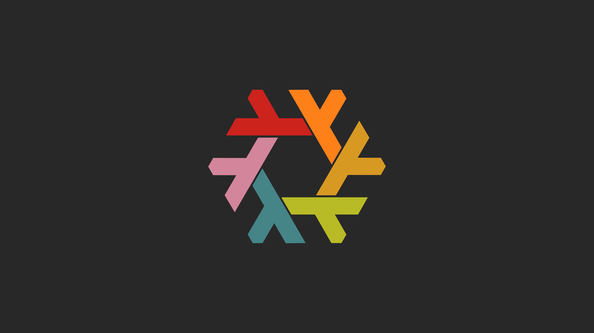
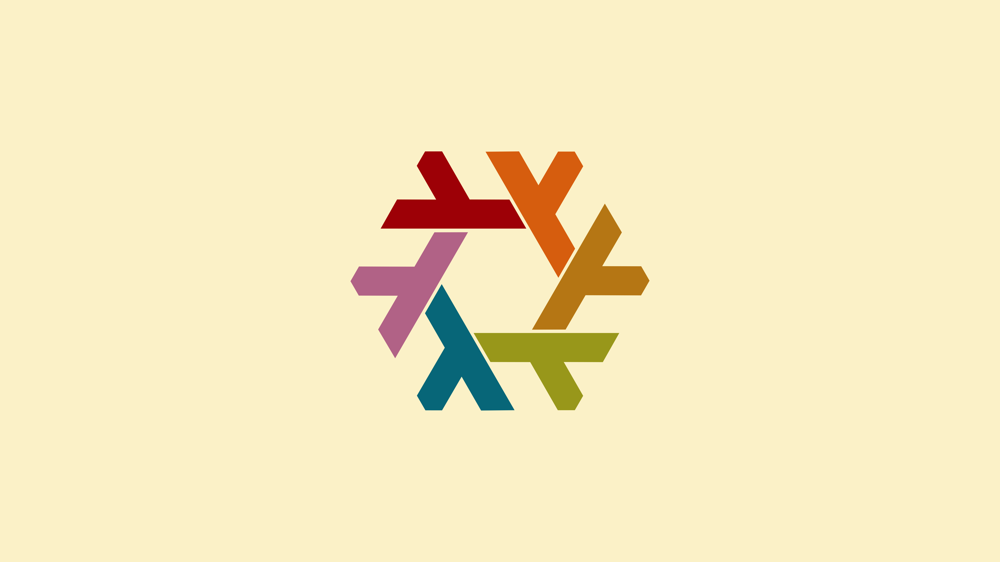

# Nixos Logo Gruvbox Wallpapers

Gruvbox-inspired NixOS logo desktop wallpapers.

gruvbox-dark-blue  

gruvbox-dark-rainbow  

gruvbox-light-blue  

gruvbox-light-rainbow  

For more NixOS artwork, 

## Credits

[NixOS Logo](https://github.com/NixOS/nixos-artwork/tree/master/logo) designed
by Tim Cuthbertson (@timbertson)

Design based on NixOS Nord Wallpaper by
[/u/saae](https://www.reddit.com/user/saae).

## License

The NixOS logo is licensed under the [Creative Commons Attribution 4.0
International License](http://creativecommons.org/licenses/by/4.0/). Additional
changes are licensed under
[CC0](https://creativecommons.org/publicdomain/zero/1.0/legalcode>).
